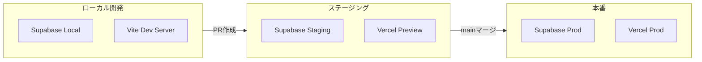

# ステージング環境セットアップガイド

このガイドでは、本番環境に影響を与えずにセキュリティ修正や新機能をテストするための、ステージング環境の構築方法を説明します。

## 目次

1. [アーキテクチャ概要](#アーキテクチャ概要)
2. [Supabaseステージングプロジェクトの作成](#supabaseステージングプロジェクトの作成)
3. [GitHub Secretsの設定](#github-secretsの設定)
4. [Vercel環境変数の設定](#vercel環境変数の設定)
5. [ローカル開発環境のセットアップ](#ローカル開発環境のセットアップ)
6. [運用フロー](#運用フロー)

---

## アーキテクチャ概要



### 環境一覧

| 環境 | ブランチ | Supabase | Vercel |
|:-----|:---------|:---------|:-------|
| ローカル | `feature/*` | Supabase Local | `localhost:5173` |
| ステージング | `staging` | mmq-yoyaq-staging | Preview URL |
| 本番 | `main` | cznpcewciwywcqcxktba | mmq-yoyaq.vercel.app |

---

## Supabaseステージングプロジェクトの作成

### 1. 新規プロジェクトの作成

1. [Supabase Dashboard](https://app.supabase.com) にログイン
2. **New Project** をクリック
3. 以下の設定で作成:
   - **Organization**: 本番と同じ組織を選択
   - **Project name**: `mmq-yoyaq-staging`
   - **Database Password**: 強力なパスワードを設定（控えておく）
   - **Region**: `Northeast Asia (Tokyo)` ※本番と同じ

4. プロジェクト作成後、以下をメモ:
   - **Project URL**: `https://xxxxxx.supabase.co`
   - **Project Reference ID**: `xxxxxx`（URLの一部）
   - **anon public key**: Settings > API から取得

### 2. 本番データベースのスキーマをコピー

ローカルで以下を実行:

```bash
# ステージングプロジェクトにリンク
npx supabase link --project-ref <staging-project-ref>

# マイグレーションを適用
npx supabase db push
```

### 3. Edge Functionsのデプロイ

```bash
# すべてのEdge Functionsをデプロイ
npx supabase functions deploy --all
```

### 4. テストデータの投入（オプション）

本番データの一部を匿名化してインポートするか、ダミーデータを投入:

```sql
-- 例: テスト用組織の作成
INSERT INTO organizations (id, name, slug)
VALUES ('test-org-id', 'テスト組織', 'test-org');
```

---

## GitHub Secretsの設定

GitHub リポジトリの Settings > Secrets and variables > Actions で以下を設定:

### 必須のSecrets

| Secret名 | 説明 | 取得方法 |
|----------|------|----------|
| `SUPABASE_ACCESS_TOKEN` | Supabase CLIの認証トークン | [Account > Access Tokens](https://app.supabase.com/account/tokens) |
| `SUPABASE_STAGING_PROJECT_ID` | ステージングのProject Ref | Dashboard > Settings > General |
| `SUPABASE_PROD_PROJECT_ID` | 本番のProject Ref | `cznpcewciwywcqcxktba` |

### 設定手順

1. GitHub リポジトリを開く
2. **Settings** > **Secrets and variables** > **Actions**
3. **New repository secret** をクリック
4. 各Secretを追加

### Environmentsの設定（推奨）

GitHub Environmentsを使用すると、デプロイ前の承認フローを設定できます:

1. **Settings** > **Environments**
2. **New environment** で `staging` と `production` を作成
3. `production` には **Required reviewers** を設定（任意）

---

## Vercel環境変数の設定

Vercel Dashboard で環境ごとに異なるSupabase URLを設定します。

### 1. Vercelプロジェクトの設定

1. [Vercel Dashboard](https://vercel.com/dashboard) でプロジェクトを開く
2. **Settings** > **Environment Variables**

### 2. 環境変数の追加

以下の変数を各環境に設定:

| 変数名 | Production | Preview | Development |
|--------|------------|---------|-------------|
| `VITE_SUPABASE_URL` | 本番URL | ステージングURL | ステージングURL |
| `VITE_SUPABASE_PUBLISHABLE_KEY` | 本番anon key | ステージングanon key | ステージングanon key |
| `VITE_APP_ENV` | `production` | `staging` | `staging` |

### 3. ブランチ別デプロイ設定

**Settings** > **Git** で:
- **Production Branch**: `main`

これにより:
- `main` へのpush → Production環境にデプロイ
- `staging` へのpush → Preview環境（固定URL）にデプロイ
- その他のブランチ → Preview環境にデプロイ

---

## ローカル開発環境のセットアップ

### 1. Supabase CLIのインストール

```bash
# macOS
brew install supabase/tap/supabase

# npm（どのOSでも可）
npm install -g supabase
```

### 2. 環境変数ファイルの準備

```bash
# ローカル開発用
cp .env.local.example .env.local
```

### 3. Supabase Localの起動

```bash
# 起動
npm run supabase:start

# 起動後に表示される anon key を .env.local に設定
```

### 4. 開発サーバーの起動

```bash
# Supabase Local + Vite
npm run dev:local

# または別々に
npm run supabase:start
npm run dev
```

### 5. 開発時のマイグレーション作成

```bash
# 新しいマイグレーションを作成
npm run supabase:migration:new my_migration_name

# supabase/migrations/YYYYMMDDHHMMSS_my_migration_name.sql が作成される
```

---

## 運用フロー

### 日常の開発フロー

```
1. feature/* ブランチを作成
   git checkout -b feature/my-feature

2. ローカルで開発・テスト
   npm run dev:local

3. マイグレーションがある場合はローカルでテスト
   npm run supabase:reset

4. stagingブランチにPR作成
   - CI/CDが自動でステージングにデプロイ

5. ステージング環境で動作確認
   - Preview URLで確認

6. 問題なければ staging → main にマージ
   - 本番環境に自動デプロイ
```

### セキュリティ修正のフロー

```
1. security/fix-xxx ブランチを作成

2. ローカルで修正・テスト
   - RLSポリシーの変更はローカルDBで十分にテスト

3. staging にマージしてステージングでテスト
   - 実際のデータ構造に近い環境で確認

4. 問題なければ main にマージ
   - 本番に影響を与える前に十分な検証が可能
```

### 緊急時のフロー（ホットフィックス）

```
1. hotfix/xxx ブランチを main から作成
   git checkout -b hotfix/xxx main

2. 修正を実装

3. 直接 main にマージ（緊急時のみ）
   - または staging 経由で高速に確認

4. 事後的に staging にも反映
   git checkout staging
   git merge main
```

---

## トラブルシューティング

### Supabase Localが起動しない

```bash
# Dockerが起動しているか確認
docker ps

# Supabaseを停止してから再起動
npm run supabase:stop
npm run supabase:start
```

### マイグレーションエラー

```bash
# ローカルDBをリセット
npm run supabase:reset

# マイグレーション一覧を確認
npm run supabase:migration:list
```

### ステージングと本番の差分確認

```bash
# ステージングにリンク
npx supabase link --project-ref <staging-project-ref>

# スキーマ差分を確認
npx supabase db diff --linked
```

---

## チェックリスト

### 初回セットアップ

- [ ] Supabaseステージングプロジェクトを作成
- [ ] GitHub Secretsを設定
  - [ ] SUPABASE_ACCESS_TOKEN
  - [ ] SUPABASE_STAGING_PROJECT_ID
  - [ ] SUPABASE_PROD_PROJECT_ID
- [ ] Vercel環境変数を設定
- [ ] stagingブランチを作成
- [ ] ワークフローの動作確認

### 日常チェック

- [ ] マイグレーションはローカルでテスト済み
- [ ] ステージングで動作確認済み
- [ ] 本番デプロイ前にレビュー完了
