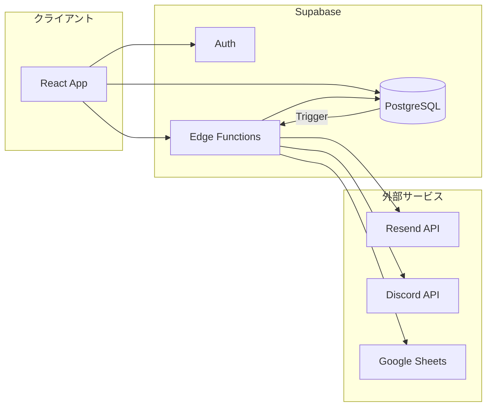
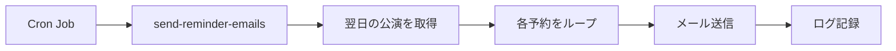
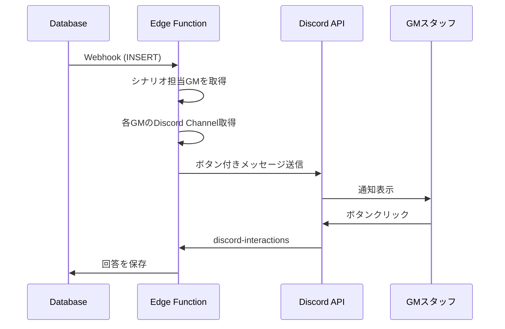
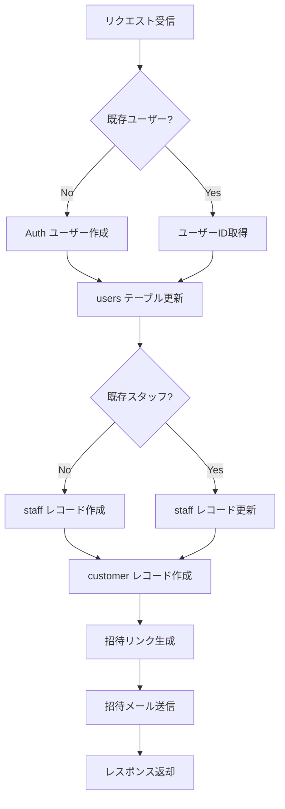
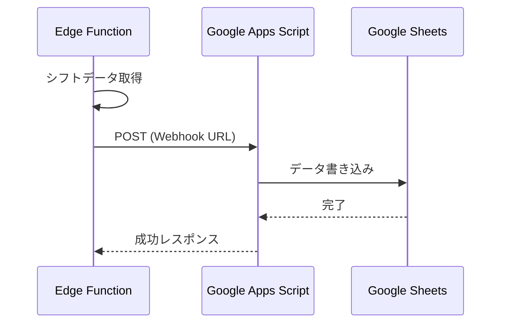

# MMQ API設計書

**最終更新**: 2026-01-10

このドキュメントは、MMQシステムのAPI（Supabase Edge Functions）を説明します。

---

## 目次

1. [概要](#1-概要)
2. [API一覧](#2-api一覧)
3. [メール通知API](#3-メール通知api)
4. [Discord通知API](#4-discord通知api)
5. [スタッフ管理API](#5-スタッフ管理api)
6. [外部連携API](#6-外部連携api)
7. [共通仕様](#7-共通仕様)

---

## 1. 概要

### 技術スタック

- **ランタイム**: Deno (Supabase Edge Functions)
- **認証**: Supabase Auth / JWT
- **外部サービス**: Resend (メール), Discord API, Google Sheets

### アーキテクチャ



### 呼び出し方法

```typescript
// Supabase クライアントから呼び出し
const { data, error } = await supabase.functions.invoke('function-name', {
  body: { /* パラメータ */ }
})

// HTTPリクエストで直接呼び出し
const response = await fetch(`${SUPABASE_URL}/functions/v1/function-name`, {
  method: 'POST',
  headers: {
    'Authorization': `Bearer ${accessToken}`,
    'Content-Type': 'application/json'
  },
  body: JSON.stringify({ /* パラメータ */ })
})
```

---

## 2. API一覧

### メール通知

| Function名 | 説明 | トリガー |
|------------|------|---------|
| `send-booking-confirmation` | 予約確認メール送信 | 予約完了時 |
| `send-reminder-emails` | リマインダーメール送信 | Cron (前日) |
| `send-cancellation-confirmation` | キャンセル確認メール送信 | キャンセル時 |
| `send-booking-change-confirmation` | 予約変更確認メール送信 | 人数変更時 |
| `send-private-booking-confirmation` | 貸切承認メール送信 | 貸切承認時 |
| `send-private-booking-rejection` | 貸切却下メール送信 | 貸切却下時 |
| `send-private-booking-request-confirmation` | 貸切申込確認メール送信 | 貸切申込時 |
| `send-author-report` | 作者向け報告メール送信 | 報告承認時 |
| `send-email` | 汎用メール送信 | 手動 |

### Discord通知

| Function名 | 説明 | トリガー |
|------------|------|---------|
| `notify-private-booking-discord` | 貸切リクエスト通知（ボタン付き） | 貸切申込時 |
| `notify-shift-request-discord` | シフト提出依頼通知 | 管理者操作 |
| `notify-shift-submitted-discord` | シフト提出完了通知 | 提出完了時 |
| `notify-shift-reminder-discord` | シフト締切リマインダー | Cron |
| `discord-interactions` | Discordボタン応答処理 | Discord Webhook |
| `discord-shift-interactions` | シフト関連ボタン応答 | Discord Webhook |

### スタッフ管理

| Function名 | 説明 | トリガー |
|------------|------|---------|
| `invite-staff` | スタッフ招待 | 管理者操作 |
| `delete-user` | ユーザー削除 | 管理者操作 |

### 外部連携

| Function名 | 説明 | トリガー |
|------------|------|---------|
| `sync-shifts-to-google-sheet` | シフトデータをGoogle Sheetsに同期 | 提出完了時 |
| `tweet-available-seats` | 空き情報をXにツイート | Cron |
| `auto-send-reminder-emails` | 自動リマインダー実行 | Cron |
| `schedule-reminder-emails` | リマインダースケジュール登録 | 管理者操作 |

---

## 3. メール通知API

### 3.1 send-booking-confirmation

予約完了時に顧客へ確認メールを送信します。

#### リクエスト

```typescript
interface BookingConfirmationRequest {
  reservationId: string
  organizationId?: string
  customerEmail: string
  customerName: string
  scenarioTitle: string
  eventDate: string        // YYYY-MM-DD
  startTime: string        // HH:MM
  endTime: string          // HH:MM
  storeName: string
  storeAddress?: string
  participantCount: number
  totalPrice: number
  reservationNumber: string
}
```

#### レスポンス

```typescript
// 成功時
{
  success: true,
  message: "メールを送信しました",
  emailId: "xxx-xxx-xxx"
}

// 失敗時
{
  success: false,
  error: "エラーメッセージ"
}
```

#### 使用例

```typescript
const { data, error } = await supabase.functions.invoke('send-booking-confirmation', {
  body: {
    reservationId: reservation.id,
    organizationId: organizationId,
    customerEmail: customer.email,
    customerName: customer.name,
    scenarioTitle: scenario.title,
    eventDate: event.date,
    startTime: event.start_time,
    endTime: event.end_time,
    storeName: store.name,
    storeAddress: store.address,
    participantCount: reservation.participant_count,
    totalPrice: reservation.final_price,
    reservationNumber: reservation.reservation_number
  }
})
```

---

### 3.2 send-reminder-emails

公演前日にリマインダーメールを送信します。Cronジョブから呼び出されます。

#### リクエスト

```typescript
interface ReminderEmailsRequest {
  targetDate?: string  // YYYY-MM-DD（省略時は翌日）
  organizationId?: string
}
```

#### 処理フロー



---

### 3.3 send-private-booking-confirmation

貸切予約が承認された際に顧客へ確認メールを送信します。

#### リクエスト

```typescript
interface PrivateBookingConfirmationRequest {
  reservationId: string
  organizationId?: string
  customerEmail: string
  customerName: string
  scenarioTitle: string
  confirmedDate: string
  confirmedTime: string
  storeName: string
  storeAddress?: string
  participantCount: number
  totalPrice: number
  reservationNumber: string
  gmName?: string
}
```

---

### 3.4 send-author-report

作者に公演報告を通知します。

#### リクエスト

```typescript
interface AuthorReportRequest {
  authorEmail: string
  authorName: string
  organizationName: string
  reports: Array<{
    scenarioTitle: string
    performanceDate: string
    performanceCount: number
    participantCount?: number
    licenseAmount: number
  }>
  periodStart: string
  periodEnd: string
}
```

---

## 4. Discord通知API

### 4.1 notify-private-booking-discord

貸切リクエストを担当GMに通知します。インタラクティブボタン付きメッセージを送信します。

#### リクエスト（Database Webhook形式）

```typescript
interface PrivateBookingNotification {
  type: 'insert'
  table: 'reservations'
  record: {
    id: string
    organization_id?: string
    customer_name: string
    customer_email: string
    customer_phone: string
    scenario_id: string
    scenario_title: string
    participant_count: number
    candidate_datetimes: {
      candidates: Array<{
        order: number
        date: string
        timeSlot: string
        startTime: string
        endTime: string
      }>
      requestedStores?: Array<{
        storeId: string
        storeName: string
      }>
    }
    notes?: string
    created_at: string
  }
}
```

#### 処理フロー



#### Discordメッセージ形式

```
@here

【貸切希望】シナリオ名（候補3件）を受け付けました。
出勤可能な日程を選択してください。

予約受付日：2026/01/10 10:00
シナリオ：シナリオ名
参加人数：6名
予約者：山田太郎

[候補1: 1/15 夜 18:00-21:00] [候補2: 1/16 昼 13:00-16:00] [候補3: 1/17 夜 18:00-21:00]
[全て不可]
```

---

### 4.2 discord-interactions

Discordのボタンクリックを処理するWebhookエンドポイントです。

#### リクエスト（Discord Interactions形式）

```typescript
interface DiscordInteraction {
  type: number  // 3 = MESSAGE_COMPONENT
  data: {
    custom_id: string  // "date_1_{reservation_id}" or "gm_unavailable_{reservation_id}"
    component_type: number
  }
  member: {
    user: {
      id: string
      username: string
    }
  }
  channel_id: string
  message: {
    id: string
  }
}
```

#### custom_id パターン

| パターン | 説明 |
|---------|------|
| `date_{n}_{reservationId}` | 候補n日目が可能 |
| `gm_unavailable_{reservationId}` | 全て不可 |
| `shift_ok_{staffId}_{month}` | シフト確認OK |
| `shift_ng_{staffId}_{month}` | シフト未提出 |

---

### 4.3 notify-shift-request-discord

シフト提出依頼を全GMに通知します。

#### リクエスト

```typescript
interface ShiftRequestNotification {
  organizationId?: string
  month: string  // "2026-01"
  deadline: string  // "2026-01-05"
  message?: string
}
```

---

## 5. スタッフ管理API

### 5.1 invite-staff

新規スタッフを招待します。Auth ユーザー作成、staff テーブル登録、招待メール送信を一括で行います。

#### リクエスト

```typescript
interface InviteStaffRequest {
  email: string
  name: string
  phone?: string
  line_name?: string
  x_account?: string
  discord_id?: string
  discord_channel_id?: string
  role?: string[]      // ['gm', 'staff'] など
  stores?: string[]    // 所属店舗ID
  organization_id?: string
}
```

#### レスポンス

```typescript
{
  success: true,
  message: "Staff invited successfully",
  data: {
    user_id: "uuid",
    staff_id: "uuid",
    email: "example@email.com",
    name: "スタッフ名",
    invite_link: "https://...",
    email_sent: true,
    email_error: null
  }
}
```

#### 処理フロー



---

### 5.2 delete-user

ユーザーとスタッフ情報を削除します。

#### リクエスト

```typescript
interface DeleteUserRequest {
  userId: string
}
```

---

## 6. 外部連携API

### 6.1 sync-shifts-to-google-sheet

シフト提出データをGoogle Sheetsに同期します。

#### リクエスト

```typescript
interface SyncShiftsRequest {
  organizationId?: string
  month: string  // "2026-01"
  spreadsheetId?: string  // 組織設定から取得可能
}
```

#### 連携方法



---

### 6.2 tweet-available-seats

空き情報をX (Twitter) に投稿します。

#### リクエスト

```typescript
interface TweetRequest {
  organizationId?: string
  targetDate?: string  // YYYY-MM-DD（省略時は本日）
}
```

---

## 7. 共通仕様

### 7.1 CORSヘッダー

全てのEdge Functionsで以下のCORSヘッダーを返します：

```typescript
const corsHeaders = {
  'Access-Control-Allow-Origin': '*',
  'Access-Control-Allow-Headers': 'authorization, x-client-info, apikey, content-type',
  'Access-Control-Allow-Methods': 'POST, OPTIONS',
}
```

### 7.2 組織設定の取得

マルチテナント対応のため、各Functionは組織設定を取得して使用します：

```typescript
import { getEmailSettings, getDiscordSettings, getNotificationSettings } from '../_shared/organization-settings.ts'

// メール設定
const emailSettings = await getEmailSettings(supabase, organizationId)
// emailSettings: { resendApiKey, senderEmail, senderName }

// Discord設定
const discordSettings = await getDiscordSettings(supabase, organizationId)
// discordSettings: { botToken, webhookUrl }

// 通知設定
const notificationSettings = await getNotificationSettings(supabase, organizationId)
// notificationSettings: { privateBookingDiscord, shiftDiscord, ... }
```

### 7.3 エラーレスポンス形式

```typescript
// 標準エラーレスポンス
{
  success: false,
  error: "エラーメッセージ"
}

// HTTPステータス
// 400: バリデーションエラー
// 401: 認証エラー
// 500: サーバーエラー
```

### 7.4 環境変数

| 変数名 | 説明 | 用途 |
|-------|------|------|
| `SUPABASE_URL` | Supabase プロジェクトURL | 全Function |
| `SUPABASE_ANON_KEY` | Supabase 匿名キー | クライアント認証 |
| `SUPABASE_SERVICE_ROLE_KEY` | Supabase サービスキー | 管理操作 |
| `RESEND_API_KEY` | Resend APIキー | メール送信 |
| `DISCORD_BOT_TOKEN` | Discord Botトークン | Discord通知 |
| `SITE_URL` | サイトURL | リダイレクト先 |

### 7.5 デプロイ

```bash
# 単一Functionのデプロイ
supabase functions deploy function-name --project-ref <project-ref>

# 全Functionsのデプロイ
./deploy-functions.sh
```

---

## 関連ドキュメント

- [system-overview.md](../system-overview.md) - システム概要
- [features/notifications/](../features/notifications/) - 通知機能詳細
- [setup/email/](../setup/email/) - メール設定
- [setup/discord/](../setup/discord/) - Discord設定
- [setup/google-sheets/](../setup/google-sheets/) - Google Sheets連携

