# MMQ アーキテクチャ設計書

**最終更新**: 2026-01-10

このドキュメントは、MMQシステムのアーキテクチャを詳細に説明します。

---

## 目次

1. [システム概要](#1-システム概要)
2. [技術スタック](#2-技術スタック)
3. [コンポーネント構成](#3-コンポーネント構成)
4. [データフロー](#4-データフロー)
5. [認証・認可](#5-認証認可)
6. [マルチテナント設計](#6-マルチテナント設計)
7. [外部連携](#7-外部連携)
8. [デプロイメント](#8-デプロイメント)

---

## 1. システム概要

### アーキテクチャ図

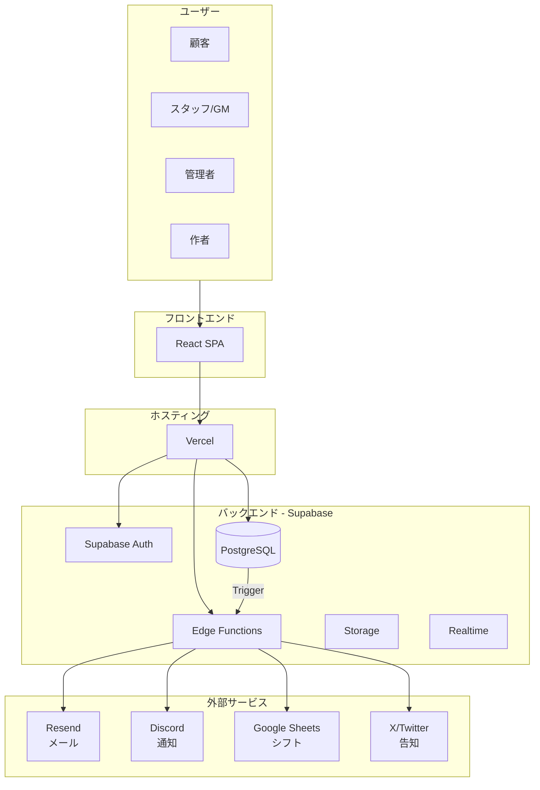

### 設計思想

| 原則 | 説明 |
|------|------|
| **サーバーレス** | Edge Functions でバックエンドロジックを実行 |
| **マルチテナント** | 1つのインスタンスで複数組織をサポート |
| **RLS セキュリティ** | データベースレベルでアクセス制御 |
| **リアルタイム** | Supabase Realtime で即座にUI反映 |

---

## 2. 技術スタック

### フロントエンド

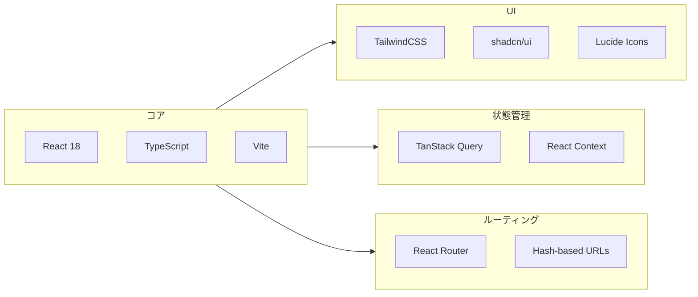

| カテゴリ | 技術 | バージョン |
|---------|------|-----------|
| フレームワーク | React | 18.x |
| 言語 | TypeScript | 5.x |
| ビルドツール | Vite | 5.x |
| UIライブラリ | shadcn/ui | latest |
| スタイリング | TailwindCSS | 3.x |
| 状態管理 | TanStack Query | 5.x |
| ルーティング | React Router | 6.x |
| フォーム | React Hook Form | 7.x |
| バリデーション | Zod | 3.x |
| 日付 | date-fns | 2.x |
| テーブル | TanStack Table | 8.x |
| トースト | Sonner | latest |

### バックエンド

| カテゴリ | 技術 |
|---------|------|
| BaaS | Supabase |
| データベース | PostgreSQL 15 |
| 認証 | Supabase Auth |
| Edge Functions | Deno |
| ストレージ | Supabase Storage |

### インフラ

| カテゴリ | 技術 |
|---------|------|
| ホスティング | Vercel |
| DNS | Vercel DNS |
| CDN | Vercel Edge Network |

---

## 3. コンポーネント構成

### ディレクトリ構造

```
src/
├── App.tsx                 # ルートコンポーネント
├── main.tsx               # エントリーポイント
├── index.css              # グローバルスタイル
│
├── components/            # 共通コンポーネント
│   ├── ui/               # shadcn/ui コンポーネント
│   ├── layout/           # レイアウトコンポーネント
│   │   ├── Sidebar.tsx
│   │   ├── Header.tsx
│   │   └── Footer.tsx
│   ├── auth/             # 認証関連
│   │   └── LoginForm.tsx
│   └── common/           # 共通部品
│       ├── DataTable.tsx
│       ├── Calendar.tsx
│       └── Modal.tsx
│
├── pages/                 # ページコンポーネント
│   ├── AdminDashboard.tsx      # メインルーター
│   ├── PublicBookingTop/       # 予約サイトトップ
│   ├── ScenarioDetailPage/     # シナリオ詳細
│   ├── ScheduleManager/        # スケジュール管理
│   ├── StaffManagement/        # スタッフ管理
│   ├── ScenarioManagement/     # シナリオ管理
│   ├── ReservationManagement/  # 予約管理
│   └── ...
│
├── hooks/                 # カスタムフック
│   ├── useAuth.ts
│   ├── useOrganization.ts
│   ├── useScenarios.ts
│   └── ...
│
├── lib/                   # ライブラリ・ユーティリティ
│   ├── supabase.ts       # Supabaseクライアント
│   ├── api/              # APIラッパー
│   └── utils/            # ユーティリティ関数
│
├── contexts/              # Reactコンテキスト
│   └── AuthContext.tsx
│
├── types/                 # 型定義
│   └── index.ts
│
└── constants/             # 定数
    └── game.ts
```

### コンポーネント階層

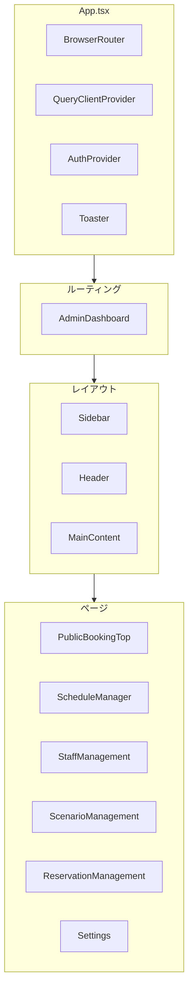

### ページコンポーネントの構造

各ページは以下の標準構造に従います：

```
PageName/
├── index.tsx           # メインコンポーネント（エントリポイント）
├── types.ts            # 型定義（Props, 内部型）
├── components/         # UI部品（Presentational）
│   ├── ComponentA.tsx
│   └── ComponentB.tsx
├── hooks/              # カスタムフック（Container Logic）
│   ├── usePageData.ts
│   └── usePageActions.ts
└── utils/              # ユーティリティ関数
    └── formatters.ts
```

---

## 4. データフロー

### 読み取りフロー

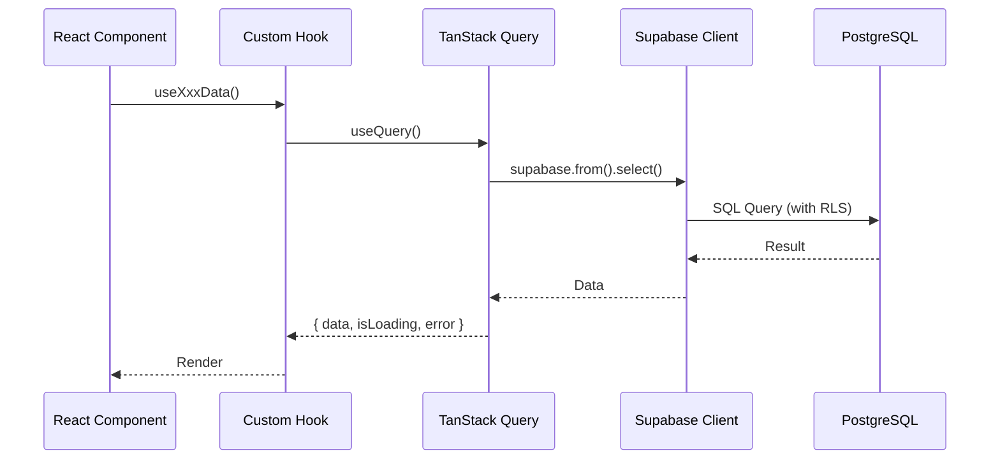

### 書き込みフロー

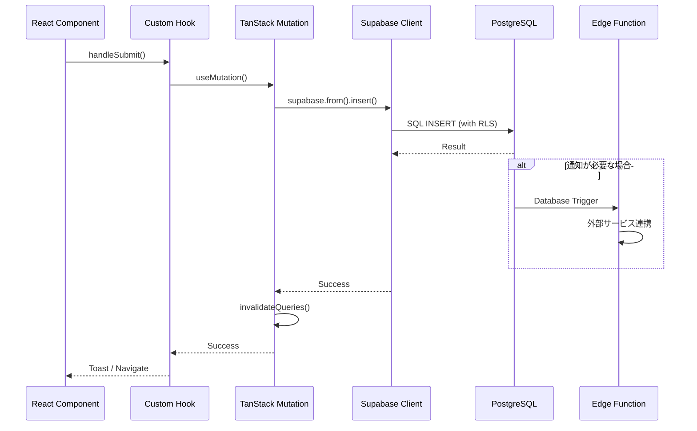

### リアルタイム更新

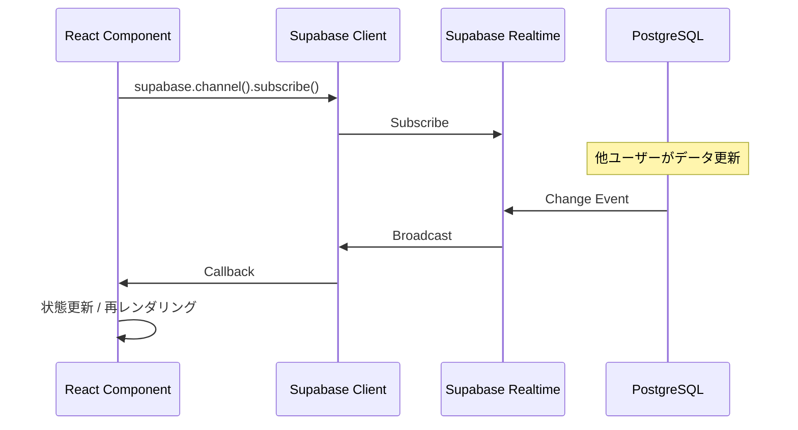

---

## 5. 認証・認可

### 認証フロー

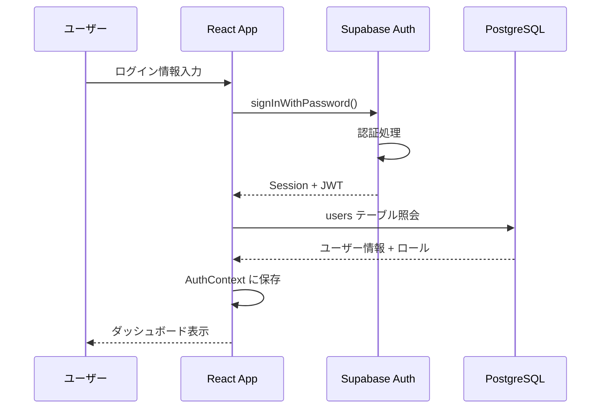

### ロールベースアクセス制御

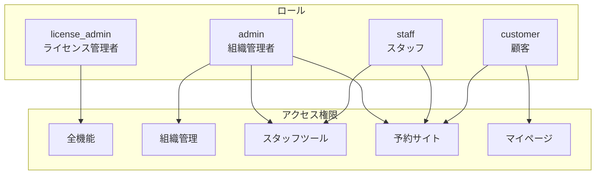

### アクセス制御の実装

```typescript
// AuthContext.tsx
interface AuthContextValue {
  user: User | null
  loading: boolean
  isInitialized: boolean
  signIn: (email: string, password: string) => Promise<void>
  signOut: () => Promise<void>
}

// ロールチェック
const isAdmin = user?.role === 'admin' || user?.role === 'license_admin'
const isStaff = user?.role === 'staff' || isAdmin
const isCustomer = user?.role === 'customer'

// ページガード
if (!isAdmin && requiresAdmin) {
  return <Navigate to="/dashboard" />
}
```

---

## 6. マルチテナント設計

### データ分離

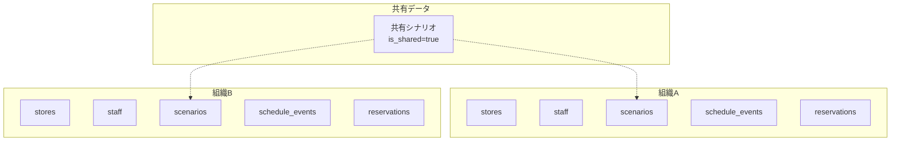

### RLSによるアクセス制御

```sql
-- 現在のユーザーの組織IDを取得
CREATE FUNCTION current_organization_id() RETURNS UUID AS $$
  SELECT organization_id FROM staff 
  WHERE user_id = auth.uid() 
  LIMIT 1;
$$ LANGUAGE SQL SECURITY DEFINER;

-- RLSポリシー例
CREATE POLICY stores_org_policy ON stores
  FOR ALL USING (
    organization_id = current_organization_id()
    OR EXISTS (
      SELECT 1 FROM users WHERE id = auth.uid() AND role = 'license_admin'
    )
  );

-- 共有シナリオのポリシー
CREATE POLICY scenarios_org_policy ON scenarios
  FOR SELECT USING (
    organization_id = current_organization_id()
    OR is_shared = true
  );
```

### フロントエンドでの組織管理

```typescript
// useOrganization.ts
export function useOrganization() {
  const { user } = useAuth()
  
  // staff テーブルから organization_id を取得
  const { data: staff } = useQuery({
    queryKey: ['current-staff', user?.id],
    queryFn: async () => {
      const { data } = await supabase
        .from('staff')
        .select('organization_id, organizations(*)')
        .eq('user_id', user?.id)
        .single()
      return data
    },
    enabled: !!user?.id
  })
  
  return {
    organizationId: staff?.organization_id,
    organization: staff?.organizations
  }
}
```

---

## 7. 外部連携

### 連携アーキテクチャ

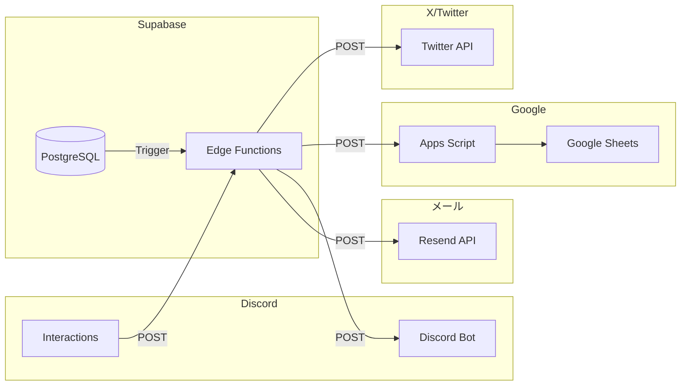

### メール連携 (Resend)

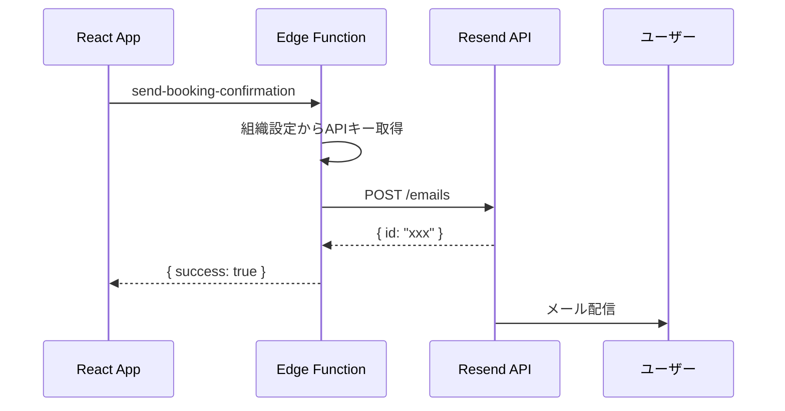

### Discord連携

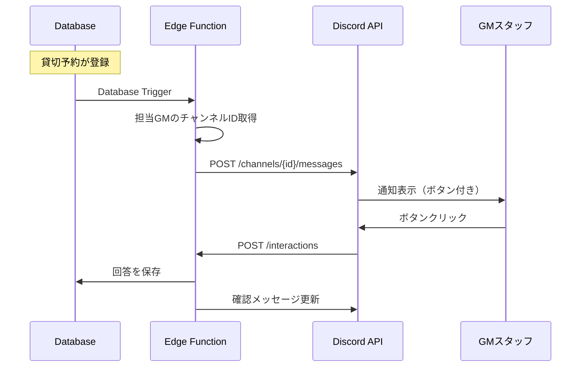

---

## 8. デプロイメント

### デプロイフロー

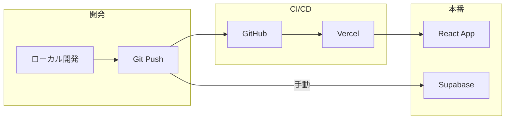

### 環境

| 環境 | URL | 用途 |
|------|-----|------|
| 開発 | localhost:5173 | ローカル開発 |
| Preview | xxx.vercel.app | PR プレビュー |
| 本番 | mmq-yoyaq.vercel.app | 本番環境 |

### デプロイコマンド

```bash
# フロントエンド（自動）
git push origin main

# Edge Functions
./deploy-functions.sh

# 単一Function
./deploy-single-function.sh function-name

# データベースマイグレーション
supabase migration up --project-ref <ref>
```

### 環境変数

#### Vercel

| 変数 | 説明 |
|------|------|
| `VITE_SUPABASE_URL` | Supabase プロジェクトURL |
| `VITE_SUPABASE_ANON_KEY` | Supabase 匿名キー |

#### Supabase

| 変数 | 説明 |
|------|------|
| `RESEND_API_KEY` | Resend APIキー |
| `DISCORD_BOT_TOKEN` | Discord Botトークン |
| `SITE_URL` | サイトURL |

---

## 関連ドキュメント

- [system-overview.md](../system-overview.md) - システム概要
- [database-design.md](./database-design.md) - データベース設計
- [api-design.md](./api-design.md) - API設計
- [screen-flow.md](./screen-flow.md) - 画面遷移図
- [deployment/deployment-strategy.md](../deployment/deployment-strategy.md) - デプロイ戦略

