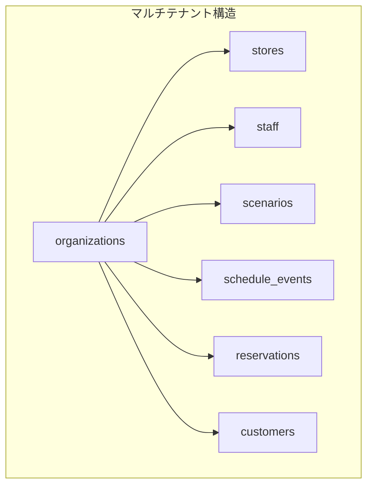
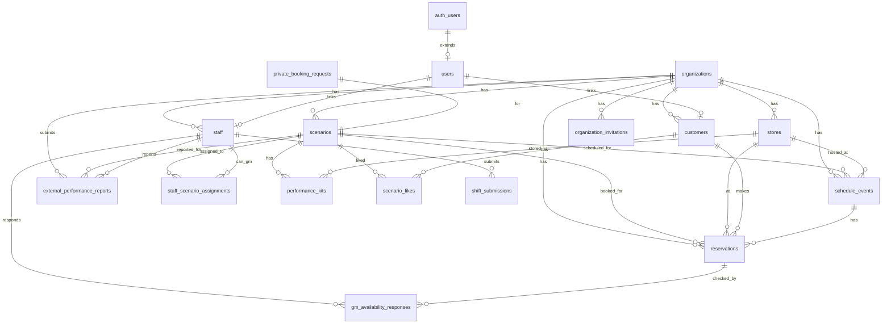
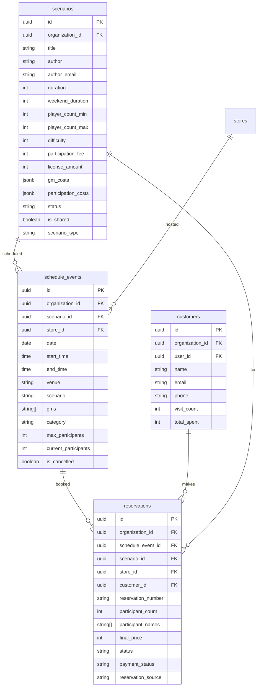
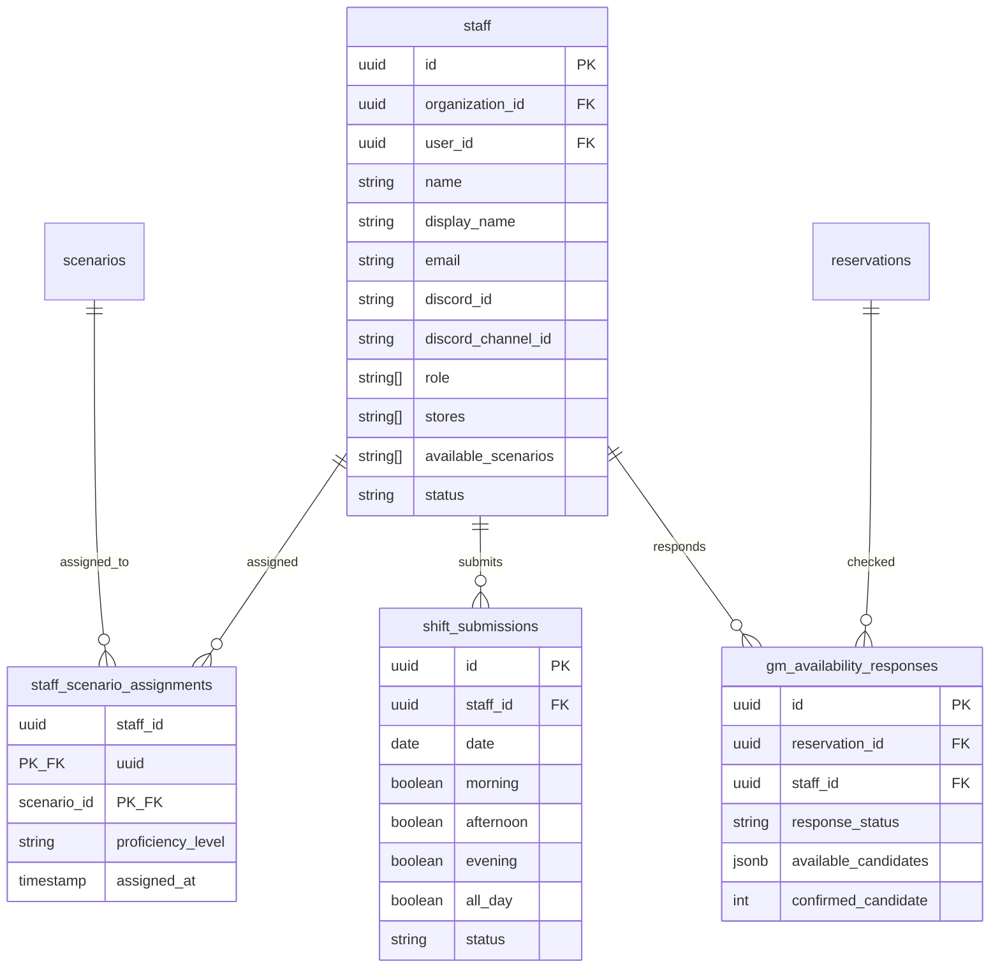

# MMQ データベース設計書

**最終更新**: 2026-01-10

このドキュメントは、MMQシステムのデータベース構造を説明します。

---

## 目次

1. [概要](#1-概要)
2. [ER図](#2-er図)
3. [テーブル一覧](#3-テーブル一覧)
4. [テーブル詳細](#4-テーブル詳細)
5. [リレーション詳細](#5-リレーション詳細)
6. [インデックス](#6-インデックス)
7. [RLSポリシー](#7-rlsポリシー)
8. [ビュー・関数](#8-ビュー関数)

---

## 1. 概要

### 技術スタック

- **データベース**: PostgreSQL (Supabase)
- **認証**: Supabase Auth
- **セキュリティ**: Row Level Security (RLS)

### マルチテナント設計

全ての主要テーブルは `organization_id` カラムを持ち、RLSによってデータが組織ごとに分離されています。



---

## 2. ER図

### 2.1 全体構成



### 2.2 コア機能（予約・スケジュール）



### 2.3 スタッフ管理



### 2.4 マルチテナント・認証

```mermaid
erDiagram
    organizations {
        uuid id PK
        string name
        string slug UK
        string plan
        string contact_email
        boolean is_license_manager
        boolean is_active
        jsonb settings
    }
    
    organization_invitations {
        uuid id PK
        uuid organization_id FK
        string email
        string name
        string[] role
        string token UK
        timestamp expires_at
        timestamp accepted_at
        uuid staff_id FK
    }
    
    users {
        uuid id PK_FK
        string email
        string role
    }
    
    organizations ||--o{ organization_invitations : invites
    organization_invitations }o--|| staff : creates
    auth_users ||--|| users : extends
```

---

## 3. テーブル一覧

### コアテーブル

| テーブル名 | 説明 | organization_id |
|-----------|------|-----------------|
| `organizations` | 組織（マルチテナント） | - |
| `stores` | 店舗 | ✓ |
| `staff` | スタッフ | ✓ |
| `scenarios` | シナリオ | ✓ (NULLは共有) |
| `schedule_events` | 公演スケジュール | ✓ |
| `reservations` | 予約 | ✓ |
| `customers` | 顧客 | ✓ |

### 関連テーブル

| テーブル名 | 説明 | 関連テーブル |
|-----------|------|-------------|
| `users` | ユーザー（Supabase Auth拡張） | auth.users |
| `staff_scenario_assignments` | スタッフ⇔シナリオ割当 | staff, scenarios |
| `shift_submissions` | シフト提出 | staff |
| `gm_availability_responses` | GM空き確認回答 | staff, reservations |
| `private_booking_requests` | 貸切リクエスト | scenarios, stores |
| `performance_kits` | 公演キット在庫 | scenarios, stores |
| `scenario_likes` | シナリオお気に入り | customers, scenarios |

### ライセンス管理テーブル

| テーブル名 | 説明 | 関連テーブル |
|-----------|------|-------------|
| `external_performance_reports` | 外部公演報告 | scenarios, organizations, staff |
| `organization_invitations` | 組織招待 | organizations, staff |

### 設定テーブル

| テーブル名 | 説明 |
|-----------|------|
| `global_settings` | システム全体設定 |
| `notification_settings` | 通知設定 |
| `miscellaneous_transactions` | その他取引（売上調整） |

---

## 4. テーブル詳細

### 4.1 organizations（組織）

マルチテナントの中心となるテーブル。

| カラム | 型 | 説明 |
|-------|-----|------|
| id | UUID | 主キー |
| name | TEXT | 組織名 |
| slug | TEXT | URL用識別子（ユニーク） |
| plan | TEXT | プラン（free/basic/pro） |
| contact_email | TEXT | 連絡先メール |
| contact_name | TEXT | 担当者名 |
| is_license_manager | BOOLEAN | ライセンス管理組織か |
| is_active | BOOLEAN | アクティブか |
| settings | JSONB | 組織設定 |
| notes | TEXT | メモ |

### 4.2 stores（店舗）

| カラム | 型 | 説明 |
|-------|-----|------|
| id | UUID | 主キー |
| organization_id | UUID | 組織ID（FK） |
| name | TEXT | 店舗名 |
| short_name | TEXT | 短縮名 |
| address | TEXT | 住所 |
| phone_number | TEXT | 電話番号 |
| email | TEXT | メール |
| status | TEXT | active/temporarily_closed/closed |
| capacity | INT | 収容人数 |
| rooms | INT | 部屋数 |
| color | TEXT | カレンダー表示色 |
| ownership_type | TEXT | corporate/franchise/office |
| is_temporary | BOOLEAN | 臨時会場フラグ |
| fixed_costs | JSONB | 固定費 |
| display_order | INT | 表示順序 |

### 4.3 staff（スタッフ）

| カラム | 型 | 説明 |
|-------|-----|------|
| id | UUID | 主キー |
| organization_id | UUID | 組織ID（FK） |
| user_id | UUID | ユーザーID（FK、オプション） |
| name | TEXT | 氏名 |
| display_name | TEXT | 表示名 |
| email | TEXT | メール |
| phone | TEXT | 電話番号 |
| discord_id | TEXT | Discord ID |
| discord_channel_id | TEXT | Discord チャンネルID |
| role | TEXT[] | 役割配列 |
| stores | TEXT[] | 所属店舗 |
| available_scenarios | TEXT[] | 担当可能シナリオ |
| experienced_scenarios | TEXT[] | 経験済みシナリオ |
| status | TEXT | active/inactive/on-leave |
| avatar_url | TEXT | アバター画像URL |
| avatar_color | TEXT | アバター背景色 |

### 4.4 scenarios（シナリオ）

| カラム | 型 | 説明 |
|-------|-----|------|
| id | UUID | 主キー |
| organization_id | UUID | 組織ID（NULLは共有） |
| slug | TEXT | URL用識別子 |
| title | TEXT | タイトル |
| description | TEXT | 説明 |
| author | TEXT | 作者名 |
| author_email | TEXT | 作者メール（ポータル連携） |
| duration | INT | 所要時間（分） |
| weekend_duration | INT | 土日所要時間（分） |
| player_count_min | INT | 最小人数 |
| player_count_max | INT | 最大人数 |
| difficulty | INT | 難易度（1-5） |
| participation_fee | INT | 参加費 |
| gm_test_participation_fee | INT | GMテスト参加費 |
| license_amount | INT | ライセンス料 |
| gm_test_license_amount | INT | GMテストライセンス料 |
| gm_costs | JSONB | GM報酬設定 |
| participation_costs | JSONB | 時間帯別料金 |
| status | TEXT | available/maintenance/retired |
| scenario_type | TEXT | normal/managed |
| is_shared | BOOLEAN | 共有シナリオか |
| key_visual_url | TEXT | キービジュアルURL |
| synopsis | TEXT | あらすじ |
| genre | TEXT[] | ジャンル |
| available_stores | TEXT[] | 公演可能店舗 |

### 4.5 schedule_events（公演スケジュール）

| カラム | 型 | 説明 |
|-------|-----|------|
| id | UUID | 主キー |
| organization_id | UUID | 組織ID（FK） |
| date | DATE | 公演日 |
| venue | TEXT | 会場名（旧形式） |
| store_id | UUID | 店舗ID（FK） |
| scenario | TEXT | シナリオ名（旧形式） |
| scenario_id | UUID | シナリオID（FK） |
| gms | TEXT[] | GM名リスト |
| start_time | TIME | 開始時間 |
| end_time | TIME | 終了時間 |
| category | TEXT | open/private/gmtest/testplay/offsite/venue_rental/venue_rental_free/package/mtg |
| max_participants | INT | 最大参加者数 |
| current_participants | INT | 現在の参加者数 |
| reservation_deadline_hours | INT | 予約締切時間 |
| is_reservation_enabled | BOOLEAN | 予約受付可能か |
| is_cancelled | BOOLEAN | キャンセル済みか |
| notes | TEXT | メモ |

### 4.6 reservations（予約）

| カラム | 型 | 説明 |
|-------|-----|------|
| id | UUID | 主キー |
| organization_id | UUID | 組織ID（FK） |
| reservation_number | TEXT | 予約番号（ユニーク） |
| schedule_event_id | UUID | スケジュールID（FK） |
| scenario_id | UUID | シナリオID（FK） |
| store_id | UUID | 店舗ID（FK） |
| customer_id | UUID | 顧客ID（FK） |
| title | TEXT | 予約タイトル |
| participant_count | INT | 参加人数 |
| participant_names | TEXT[] | 参加者名リスト |
| base_price | INT | 基本料金 |
| final_price | INT | 最終料金 |
| unit_price | INT | 1人あたり料金 |
| status | TEXT | pending/confirmed/completed/cancelled/no_show/gm_confirmed |
| payment_status | TEXT | pending/paid/refunded/cancelled |
| reservation_source | TEXT | web/phone/walk_in/external/web_private/staff_entry/staff_participation/demo_auto/demo |
| customer_name | TEXT | 顧客名（予約時） |
| customer_email | TEXT | 顧客メール（予約時） |
| customer_phone | TEXT | 顧客電話（予約時） |
| candidate_datetimes | JSONB | 貸切候補日時 |

### 4.7 customers（顧客）

| カラム | 型 | 説明 |
|-------|-----|------|
| id | UUID | 主キー |
| organization_id | UUID | 組織ID（FK） |
| user_id | UUID | ユーザーID（FK） |
| name | TEXT | 氏名 |
| nickname | TEXT | ニックネーム |
| email | TEXT | メール |
| phone | TEXT | 電話番号 |
| address | TEXT | 住所 |
| line_id | TEXT | LINE ID |
| visit_count | INT | 来店回数 |
| total_spent | INT | 累計支払額 |
| last_visit | DATE | 最終来店日 |
| preferences | TEXT[] | 好み |

### 4.8 private_booking_requests（貸切リクエスト）

| カラム | 型 | 説明 |
|-------|-----|------|
| id | UUID | 主キー |
| scenario_id | UUID | シナリオID（FK） |
| scenario_title | TEXT | シナリオ名 |
| customer_name | TEXT | 顧客名 |
| customer_email | TEXT | メール |
| customer_phone | TEXT | 電話 |
| preferred_dates | TIMESTAMPTZ[] | 希望日時配列 |
| preferred_stores | UUID[] | 希望店舗配列 |
| participant_count | INT | 参加人数 |
| status | TEXT | pending_gm/pending_store/approved/rejected |
| gm_responses | JSONB | GM回答 |
| approved_store_id | UUID | 承認店舗（FK） |
| rejection_reason | TEXT | 却下理由 |

### 4.9 gm_availability_responses（GM空き確認）

| カラム | 型 | 説明 |
|-------|-----|------|
| id | UUID | 主キー |
| reservation_id | UUID | 予約ID（FK） |
| staff_id | UUID | スタッフID（FK） |
| response_status | TEXT | available/all_unavailable/pending |
| available_candidates | JSONB | 可能な候補番号リスト |
| confirmed_candidate | INT | 確定候補番号 |
| notes | TEXT | メモ |
| notified_at | TIMESTAMPTZ | 通知送信日時 |
| responded_at | TIMESTAMPTZ | 回答日時 |

### 4.10 shift_submissions（シフト提出）

| カラム | 型 | 説明 |
|-------|-----|------|
| id | UUID | 主キー |
| staff_id | UUID | スタッフID（FK） |
| date | DATE | 日付 |
| morning | BOOLEAN | 午前 |
| afternoon | BOOLEAN | 午後 |
| evening | BOOLEAN | 夜 |
| all_day | BOOLEAN | 終日 |
| status | TEXT | draft/submitted/approved/rejected |
| submitted_at | TIMESTAMPTZ | 提出日時 |

### 4.11 external_performance_reports（外部公演報告）

| カラム | 型 | 説明 |
|-------|-----|------|
| id | UUID | 主キー |
| scenario_id | UUID | シナリオID（FK） |
| organization_id | UUID | 報告組織ID（FK） |
| reported_by | UUID | 報告者スタッフID（FK） |
| performance_date | DATE | 公演日 |
| performance_count | INT | 公演回数 |
| participant_count | INT | 参加者数 |
| venue_name | TEXT | 会場名 |
| status | TEXT | pending/approved/rejected |
| reviewed_by | UUID | 承認者（FK） |
| reviewed_at | TIMESTAMPTZ | 承認日時 |
| rejection_reason | TEXT | 却下理由 |

---

## 5. リレーション詳細

### 5.1 主要な外部キー

| テーブル | カラム | 参照先 | ON DELETE |
|---------|--------|--------|-----------|
| stores | organization_id | organizations | RESTRICT |
| staff | organization_id | organizations | RESTRICT |
| staff | user_id | users | SET NULL |
| scenarios | organization_id | organizations | RESTRICT |
| schedule_events | organization_id | organizations | RESTRICT |
| schedule_events | scenario_id | scenarios | RESTRICT |
| schedule_events | store_id | stores | RESTRICT |
| reservations | organization_id | organizations | RESTRICT |
| reservations | schedule_event_id | schedule_events | SET NULL |
| reservations | scenario_id | scenarios | RESTRICT |
| reservations | store_id | stores | RESTRICT |
| reservations | customer_id | customers | RESTRICT |
| customers | organization_id | organizations | RESTRICT |
| customers | user_id | users | CASCADE |
| users | id | auth.users | CASCADE |

### 5.2 多対多リレーション

| リレーション | 中間テーブル |
|------------|-------------|
| staff ⇔ scenarios | staff_scenario_assignments |
| customers ⇔ scenarios (お気に入り) | scenario_likes |

---

## 6. インデックス

### 主要インデックス

```sql
-- 組織フィルタ用（全テーブル共通）
CREATE INDEX idx_{table}_organization_id ON {table}(organization_id);

-- ステータス検索
CREATE INDEX idx_stores_status ON stores(status);
CREATE INDEX idx_scenarios_status ON scenarios(status);
CREATE INDEX idx_staff_status ON staff(status);
CREATE INDEX idx_reservations_status ON reservations(status);

-- 日付検索
CREATE INDEX idx_schedule_events_date ON schedule_events(date);
CREATE INDEX idx_reservations_datetime ON reservations(requested_datetime);
CREATE INDEX idx_shift_submissions_date ON shift_submissions(date);

-- 外部キー検索
CREATE INDEX idx_reservations_schedule_event_id ON reservations(schedule_event_id);
CREATE INDEX idx_reservations_customer_id ON reservations(customer_id);

-- ユニーク
CREATE UNIQUE INDEX idx_organizations_slug ON organizations(slug);
CREATE UNIQUE INDEX idx_reservations_number ON reservations(reservation_number);
```

---

## 7. RLSポリシー

### 7.1 基本方針

- **organization_id によるデータ分離**: 各組織は自組織のデータのみアクセス可能
- **ロールベースアクセス**: admin/staff/customer で権限を分ける
- **共有データ**: `is_shared = true` のシナリオは全組織から参照可能

### 7.2 ポリシー例

```sql
-- 組織フィルタポリシー（典型パターン）
CREATE POLICY stores_org_policy ON stores
  FOR ALL USING (
    organization_id = current_organization_id()
    OR is_admin()
  );

-- 共有シナリオポリシー
CREATE POLICY scenarios_org_policy ON scenarios
  FOR SELECT USING (
    organization_id = current_organization_id()
    OR is_shared = true
    OR is_admin()
  );

-- 顧客の自己データアクセス
CREATE POLICY customers_self_policy ON customers
  FOR SELECT USING (
    user_id = auth.uid()
    OR organization_id = current_organization_id()
  );
```

### 7.3 ヘルパー関数

```sql
-- 現在の組織ID取得
CREATE FUNCTION current_organization_id() RETURNS UUID AS $$
  SELECT organization_id FROM staff 
  WHERE user_id = auth.uid() 
  LIMIT 1;
$$ LANGUAGE SQL SECURITY DEFINER;

-- 管理者チェック
CREATE FUNCTION is_admin() RETURNS BOOLEAN AS $$
  SELECT EXISTS (
    SELECT 1 FROM users 
    WHERE id = auth.uid() 
    AND role IN ('admin', 'license_admin')
  );
$$ LANGUAGE SQL SECURITY DEFINER;

-- ライセンス管理者チェック
CREATE FUNCTION is_license_manager() RETURNS BOOLEAN AS $$
  SELECT EXISTS (
    SELECT 1 FROM staff s
    JOIN organizations o ON s.organization_id = o.id
    WHERE s.user_id = auth.uid()
    AND o.is_license_manager = true
  );
$$ LANGUAGE SQL SECURITY DEFINER;
```

---

## 8. ビュー・関数

### 8.1 主要ビュー

| ビュー名 | 説明 |
|---------|------|
| `license_performance_summary` | ライセンス料集計 |
| `author_performance_reports` | 作者向け公演報告 |
| `author_summary` | 作者ダッシュボード集計 |
| `reservation_summary` | 予約サマリー |

### 8.2 トリガー

| トリガー | テーブル | 説明 |
|---------|---------|------|
| `update_*_updated_at` | 全テーブル | updated_at 自動更新 |
| `handle_new_user` | auth.users | ユーザー作成時に users テーブルにレコード作成 |

---

## 関連ドキュメント

- [system-overview.md](../system-overview.md) - システム概要
- [screen-flow.md](./screen-flow.md) - 画面遷移図
- [api-design.md](./api-design.md) - API設計
- [development/multi-tenant-security.md](../development/multi-tenant-security.md) - マルチテナントセキュリティ

