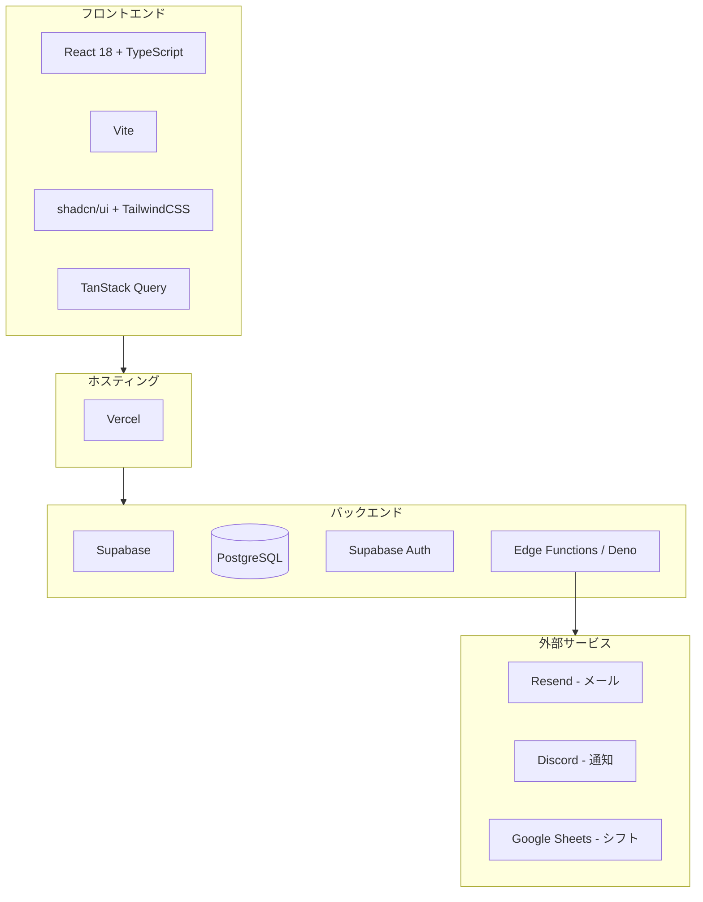
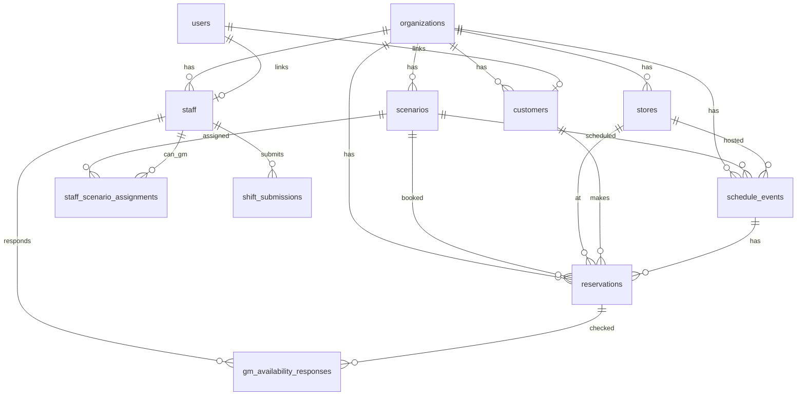
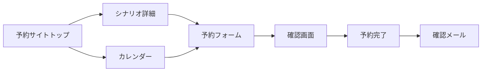
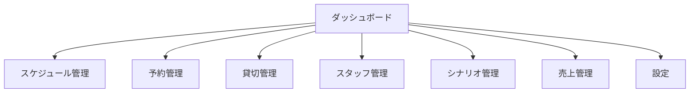
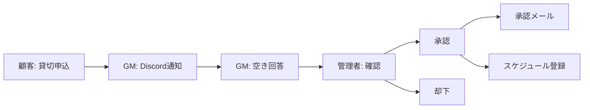
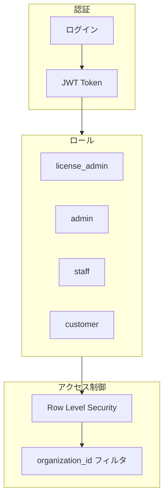

# MMQ マスター設計書

**最終更新**: 2026-01-10

このドキュメントは、MMQ（Murder Mystery Queue）システムの全体設計を1枚で俯瞰できるマスター設計書です。

---

## 1. システム概要

### MMQとは

**MMQ（Murder Mystery Queue）** は、マーダーミステリー店舗の予約・運営を管理するマルチテナント型SaaSシステムです。

```
┌─────────────────────────────────────────────────────────────────────────┐
│                           MMQ システム構成                               │
├─────────────────────────────────────────────────────────────────────────┤
│                                                                          │
│   ┌─────────────┐    ┌─────────────┐    ┌─────────────┐                 │
│   │   組織A      │    │   組織B      │    │   組織C      │                 │
│   │ queens-waltz │    │  company-a  │    │  company-b  │  ...           │
│   └──────┬──────┘    └──────┬──────┘    └──────┬──────┘                 │
│          │                  │                  │                        │
│          └─────────────┬────┴──────────────────┘                        │
│                        ▼                                                │
│   ┌─────────────────────────────────────────────────────────────────┐   │
│   │                       共通プラットフォーム                        │   │
│   │  ┌──────────────────┐          ┌──────────────────┐             │   │
│   │  │   予約サイト      │          │   管理ツール      │             │   │
│   │  │  /{org-slug}     │          │  /dashboard      │             │   │
│   │  │                  │          │                  │             │   │
│   │  │ • シナリオ検索   │          │ • スケジュール   │             │   │
│   │  │ • カレンダー予約 │          │ • 予約管理       │             │   │
│   │  │ • 貸切申込       │          │ • スタッフ管理   │             │   │
│   │  │ • マイページ     │          │ • 売上分析       │             │   │
│   │  └──────────────────┘          └──────────────────┘             │   │
│   └─────────────────────────────────────────────────────────────────┘   │
│                                                                          │
└─────────────────────────────────────────────────────────────────────────┘
```

### 対象ユーザー

| ユーザー種別 | 説明 | 主な操作 |
|-------------|------|---------|
| **顧客** | マーダーミステリーをプレイする一般ユーザー | 予約、マイページ閲覧 |
| **スタッフ/GM** | 店舗で働くゲームマスター | シフト提出、GM確認回答 |
| **管理者** | 店舗運営者 | 全機能を管理 |
| **作者** | シナリオ著者 | 公演報告の確認 |

---

## 2. 技術スタック



| レイヤー | 技術 |
|---------|------|
| フロントエンド | React + TypeScript + Vite |
| UI | shadcn/ui + TailwindCSS |
| 状態管理 | TanStack Query |
| バックエンド | Supabase (PostgreSQL + Auth + Edge Functions) |
| ホスティング | Vercel |
| メール | Resend API |
| 通知 | Discord Bot + Webhook |

---

## 3. データベース構造（ER図サマリー）



### 主要テーブル

| テーブル | 説明 | 主なカラム |
|---------|------|-----------|
| **organizations** | 組織（マルチテナント） | id, name, slug, is_license_manager |
| **stores** | 店舗 | id, name, organization_id, status |
| **staff** | スタッフ | id, name, role[], organization_id |
| **scenarios** | シナリオ | id, title, duration, player_count_min/max |
| **schedule_events** | 公演スケジュール | id, date, store_id, scenario_id, gms[] |
| **reservations** | 予約 | id, customer_id, schedule_event_id, status |
| **customers** | 顧客 | id, user_id, name, email |

---

## 4. 画面遷移図（主要フロー）

### 顧客フロー



### 管理者フロー



### 貸切予約フロー



---

## 5. 機能一覧

### コア機能

| 機能 | 説明 | 主要コンポーネント |
|------|------|-------------------|
| **予約管理** | オンライン予約、貸切申込 | PublicBookingTop, ReservationManagement |
| **スケジュール管理** | 公演スケジュールの登録・編集 | ScheduleManager |
| **スタッフ管理** | スタッフ情報、招待、権限 | StaffManagement |
| **シナリオ管理** | シナリオ情報、料金設定 | ScenarioManagement |

### 運営機能

| 機能 | 説明 | 主要コンポーネント |
|------|------|-------------------|
| **シフト管理** | シフト提出・締切管理 | ShiftSubmission |
| **GM確認** | 貸切リクエストへの回答 | GMAvailabilityCheck |
| **売上管理** | 売上分析・レポート | SalesManagement |
| **顧客管理** | 顧客情報・履歴 | CustomerManagement |

### 通知機能

| 種別 | サービス | 用途 |
|------|---------|------|
| **メール** | Resend | 予約確認、リマインダー、招待 |
| **Discord** | Discord Bot | 貸切通知、シフト依頼 |

### マルチテナント機能

| 機能 | 説明 | 主要コンポーネント |
|------|------|-------------------|
| **組織管理** | 組織作成・設定 | Settings |
| **テナント管理** | 全組織一覧（ライセンス管理者用） | TenantManagementSettings |
| **ライセンス管理** | 公演報告・集計 | LicenseManagement |

---

## 6. API一覧（Edge Functions）

### メール通知

| Function | トリガー |
|----------|---------|
| send-booking-confirmation | 予約完了時 |
| send-reminder-emails | Cron（前日） |
| send-private-booking-confirmation | 貸切承認時 |
| send-private-booking-rejection | 貸切却下時 |

### Discord通知

| Function | トリガー |
|----------|---------|
| notify-private-booking-discord | 貸切申込時 |
| notify-shift-request-discord | シフト依頼時 |
| discord-interactions | ボタンクリック |

### スタッフ管理

| Function | トリガー |
|----------|---------|
| invite-staff | 管理者操作 |
| delete-user | 管理者操作 |

### 外部連携

| Function | トリガー |
|----------|---------|
| sync-shifts-to-google-sheet | シフト提出時 |

---

## 7. セキュリティ

### 認証・認可



### マルチテナントセキュリティ

- **RLS（Row Level Security）**: データベースレベルでアクセス制御
- **organization_id フィルタ**: 全クエリで組織IDをフィルタ
- **共有シナリオ**: `is_shared = true` のみ他組織から参照可能

---

## 8. URL構造

### 予約サイト

| パス | ページ |
|------|--------|
| `/{org-slug}` | 予約サイトトップ |
| `/{org-slug}/calendar` | カレンダー表示 |
| `/{org-slug}/list` | リスト表示 |
| `/{org-slug}/scenario/{id}` | シナリオ詳細 |

### 管理ツール

| パス | ページ |
|------|--------|
| `/dashboard` | ダッシュボード |
| `/schedule` | スケジュール管理 |
| `/reservations` | 予約管理 |
| `/staff` | スタッフ管理 |
| `/scenarios` | シナリオ管理 |
| `/sales` | 売上管理 |
| `/settings` | 設定 |

### マイページ

| パス | ページ |
|------|--------|
| `/mypage` | マイページトップ |
| `/mypage/reservations` | 予約履歴 |
| `/mypage/profile` | プロフィール |

---

## 9. 開発環境

### セットアップ

```bash
# 依存関係インストール
npm install

# 開発サーバー起動
npm run dev

# 型チェック
npm run typecheck

# ビルド
npm run build

# 検証（typecheck + lint + build）
npm run verify
```

### 環境変数

| 変数 | 用途 |
|------|------|
| `VITE_SUPABASE_URL` | Supabase URL |
| `VITE_SUPABASE_ANON_KEY` | Supabase 匿名キー |

---

## 10. ドキュメント一覧

| ドキュメント | 内容 |
|-------------|------|
| [system-overview.md](../system-overview.md) | システム概要 |
| [pages.md](../pages.md) | ページ一覧・ルーティング |
| [features.md](../features.md) | 機能詳細 |
| [database-design.md](./database-design.md) | データベース設計（ER図） |
| [screen-flow.md](./screen-flow.md) | 画面遷移図 |
| [api-design.md](./api-design.md) | API設計（Edge Functions） |
| [architecture.md](./architecture.md) | アーキテクチャ詳細 |
| [development/](../development/) | 開発ルール |
| [features/](../features/) | 機能別詳細 |
| [setup/](../setup/) | 外部連携セットアップ |

---

## 11. 重要な注意事項

### 削除禁止機能

以下の機能はシステムの安全な運用に必須です。削除・大幅変更時は慎重に検討してください。

| 機能 | 場所 | 理由 |
|------|------|------|
| 予約重複チェック | ScheduleManager | ダブルブッキング防止 |
| 貸切競合チェック | PrivateBookingManagement | スケジュール衝突防止 |
| RLSポリシー | データベース | マルチテナントセキュリティ |
| organization_id フィルタ | 全クエリ | データ漏洩防止 |

詳細は [development/critical-features.md](../development/critical-features.md) を参照。

### コーディングルール

| ルール | 内容 |
|-------|------|
| データベースカラム名 | 事前にスキーマを確認してから実装 |
| organization_id | INSERT/SELECT で必ず設定・フィルタ |
| 型チェック | `npm run build` 前に `tsc --noEmit` 必須 |
| コミットメッセージ | 日本語で conventional commit 形式 |

詳細は `rules/rurle.mdc` を参照。

---

## 12. 残作業リスト（TODO）

このセクションは、未実装機能や既知の課題を集約したものです。

### 高優先度

| 項目 | 詳細 | 現状 |
|------|------|------|
| 重複チェックのテスト | 重要機能に対するユニットテストの追加 | 未実装 |

### 中優先度

| 項目 | 詳細 | 現状 |
|------|------|------|
| 売上レポートメール | 月末・週末に自動で売上サマリーを送信 | 未実装 |
| 予約状況アラートメール | 予約率が低い/満席間近の場合に通知 | 未実装 |
| E2Eテスト | Playwrightなどによる自動E2Eテスト | 未実装 |

### 将来検討

| 項目 | 詳細 | 現状 |
|------|------|------|
| システムエラー通知 | 重大エラー発生時に管理者へ通知 | 未実装 |
| シフト関連メール | シフト募集・確定通知をメールで送信 | Discord で代替中 |

### 完了済み（参考）

- [x] マルチテナント対応
- [x] 予約確認メール（Resend API）
- [x] リマインダーメール（Cron）
- [x] 貸切通知（Discord）
- [x] シフト通知（Discord）
- [x] スタッフ招待メール
- [x] Google Sheets連携
- [x] 予約テーブルの競合チェック追加（`useConflictCheck.ts`）
- [x] store_id 取得修正（`useBookingSubmit.ts`）
- [x] お問い合わせ送信処理（`ContactPage.tsx`）
- [x] 組織登録のロールバック処理（`OrganizationRegister`）
- [x] 営業時間制限の適用（`PerformanceModal.tsx`）
- [x] ロール情報のDB取得（`AuthContext.tsx` - 既に実装済みだったためTODOコメント削除）

