# MMQ 画面遷移図

**最終更新**: 2026-01-10

このドキュメントは、MMQシステムの画面遷移とユーザーフローを視覚化したものです。

---

## 目次

1. [全体概要](#1-全体概要)
2. [顧客フロー](#2-顧客フロー)
3. [管理者フロー](#3-管理者フロー)
4. [GMスタッフフロー](#4-gmスタッフフロー)
5. [貸切予約フロー](#5-貸切予約フロー)
6. [認証フロー](#6-認証フロー)
7. [マルチテナントフロー](#7-マルチテナントフロー)

---

## 1. 全体概要

MMQは3種類のユーザータイプに対応した画面構成を持っています。

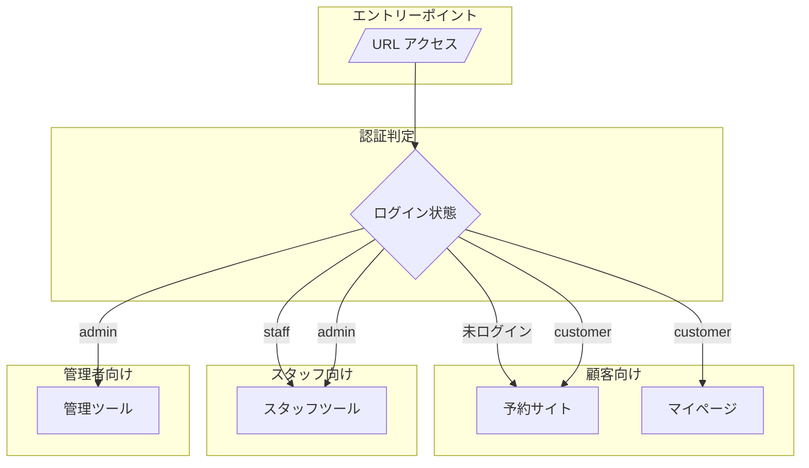

### URL構造

| パターン | 対象 | 例 |
|---------|------|-----|
| `/{org-slug}` | 予約サイト | `/queens-waltz` |
| `/{org-slug}/scenario/{id}` | シナリオ詳細 | `/queens-waltz/scenario/abc123` |
| `/dashboard` | 管理ツール | `/dashboard` |
| `/mypage` | マイページ | `/mypage/reservations` |

---

## 2. 顧客フロー

### 2.1 通常予約フロー

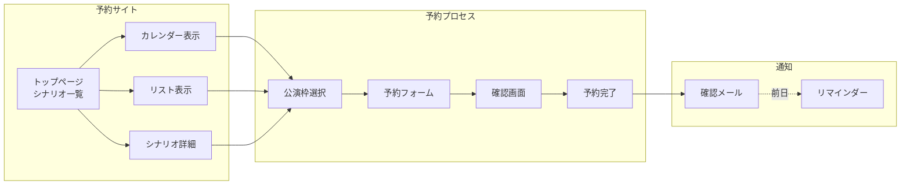

### 2.2 マイページフロー

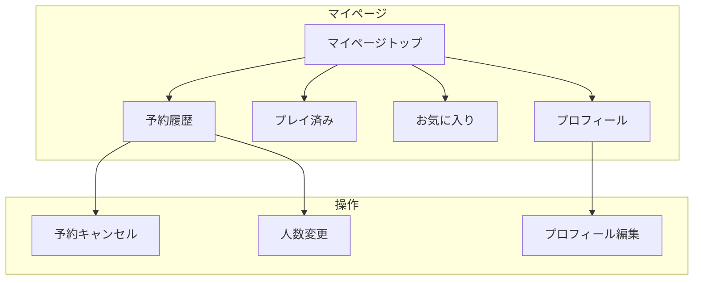

### 2.3 画面詳細

| 画面 | パス | 機能 |
|-----|------|------|
| トップページ | `/{slug}` | シナリオ一覧、検索、フィルタ |
| カレンダー | `/{slug}/calendar` | 日付×店舗マトリックス表示 |
| リスト | `/{slug}/list` | 日付順の公演一覧 |
| シナリオ詳細 | `/{slug}/scenario/{id}` | シナリオ情報、予約可能枠一覧 |
| 予約確認 | (モーダル) | 参加者情報入力、確認 |
| マイページ | `/mypage` | 予約履歴、お気に入り管理 |

---

## 3. 管理者フロー

### 3.1 メインナビゲーション

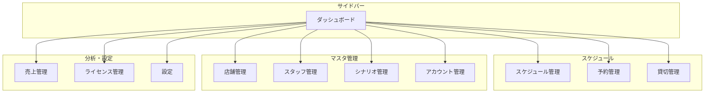

### 3.2 スケジュール管理フロー

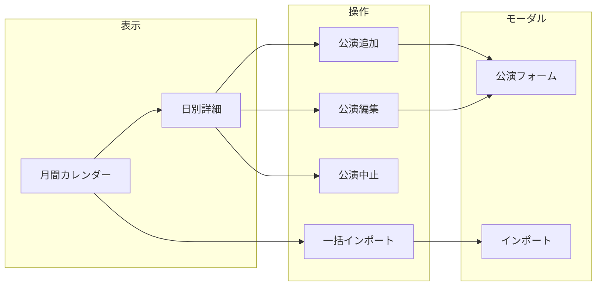

### 3.3 シナリオ管理フロー

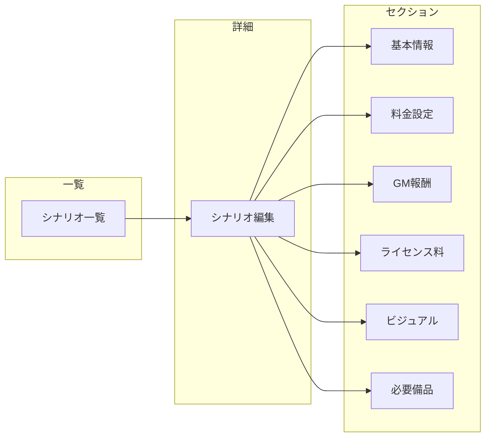

### 3.4 画面一覧

| 画面 | パス | 機能 |
|-----|------|------|
| ダッシュボード | `/dashboard` | 本日の公演、直近の予約 |
| スケジュール管理 | `/schedule` | 公演の登録・編集・中止 |
| 予約管理 | `/reservations` | 予約の確認・変更・キャンセル |
| 貸切管理 | `/private-booking-management` | 貸切リクエストの承認・却下 |
| 店舗管理 | `/stores` | 店舗情報のCRUD |
| スタッフ管理 | `/staff` | スタッフ情報・招待・権限 |
| シナリオ管理 | `/scenarios` | シナリオのCRUD |
| シナリオ編集 | `/scenarios/edit?id={id}` | シナリオ詳細編集 |
| アカウント管理 | `/accounts` | ユーザー・顧客管理 |
| 売上管理 | `/sales` | 売上分析・レポート |
| ライセンス管理 | `/license-management` | ライセンス報告・集計 |
| 設定 | `/settings` | 組織設定・テナント管理 |

---

## 4. GMスタッフフロー

### 4.1 スタッフ専用機能

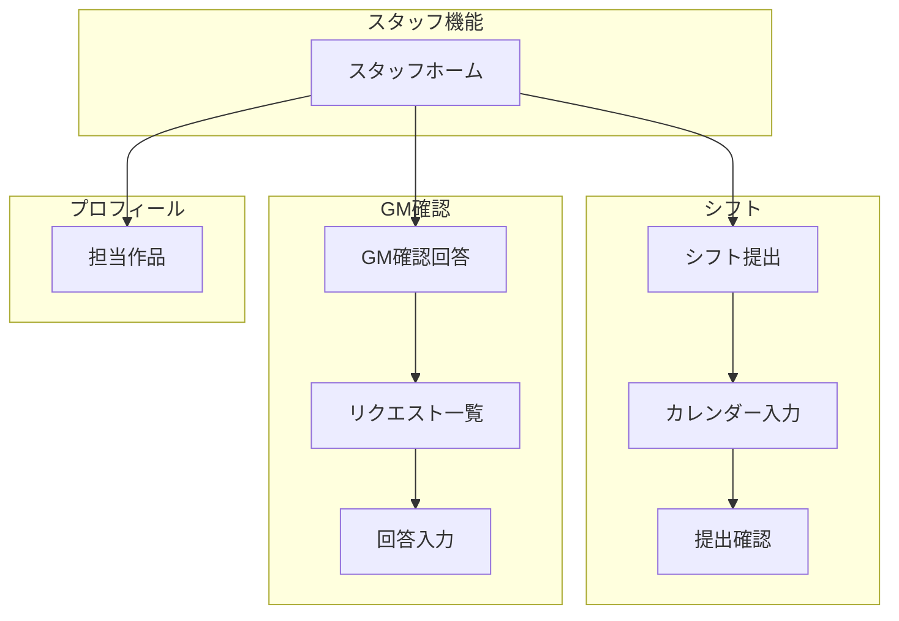

### 4.2 シフト提出フロー

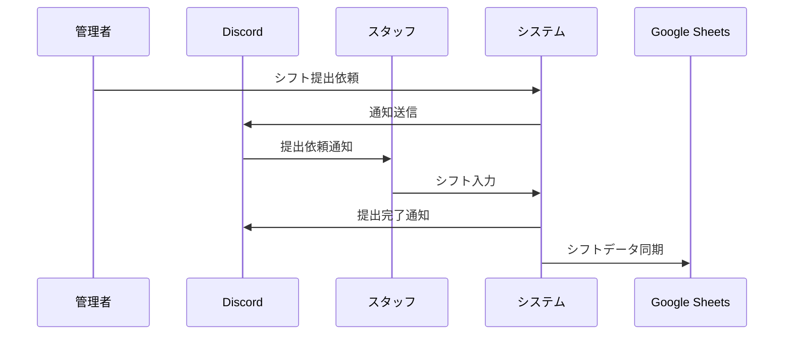

### 4.3 画面一覧

| 画面 | パス | 機能 |
|-----|------|------|
| シフト提出 | `/shift-submission` | 月間シフト希望入力 |
| GM確認回答 | `/gm-availability` | 貸切リクエストへの空き状況回答 |
| 担当作品 | `/staff-profile` | 担当可能シナリオ確認 |
| マニュアル | `/manual` | 操作マニュアル |

---

## 5. 貸切予約フロー

### 5.1 全体フロー

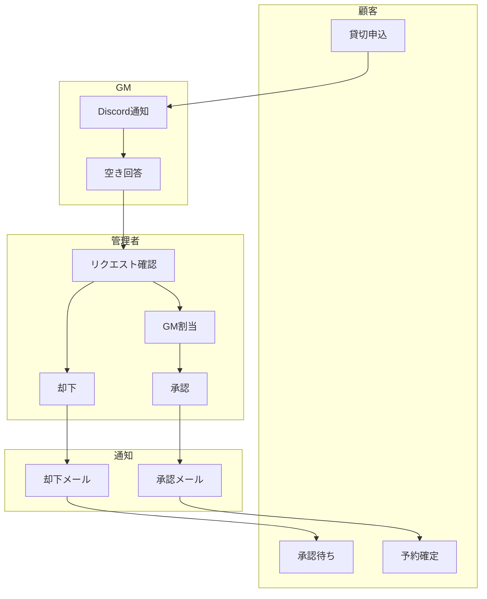

### 5.2 詳細シーケンス

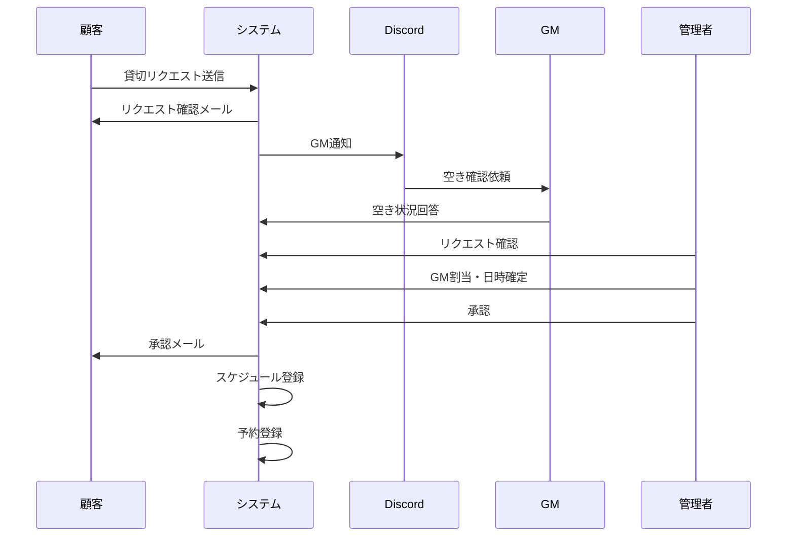

### 5.3 ステータス遷移

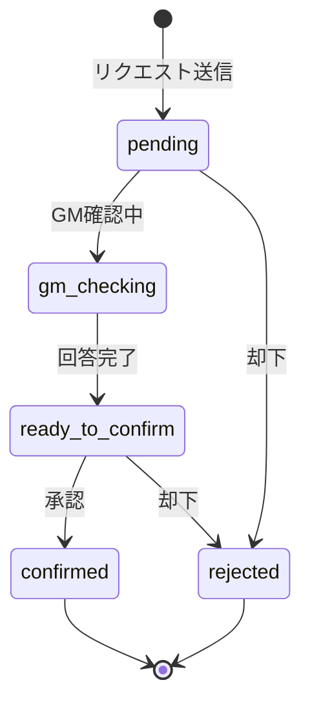

---

## 6. 認証フロー

### 6.1 ログイン・サインアップ

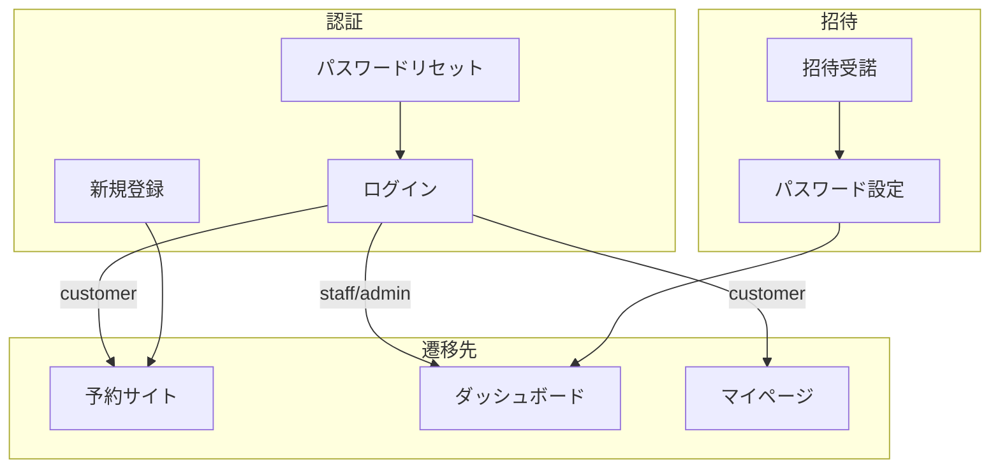

### 6.2 招待フロー

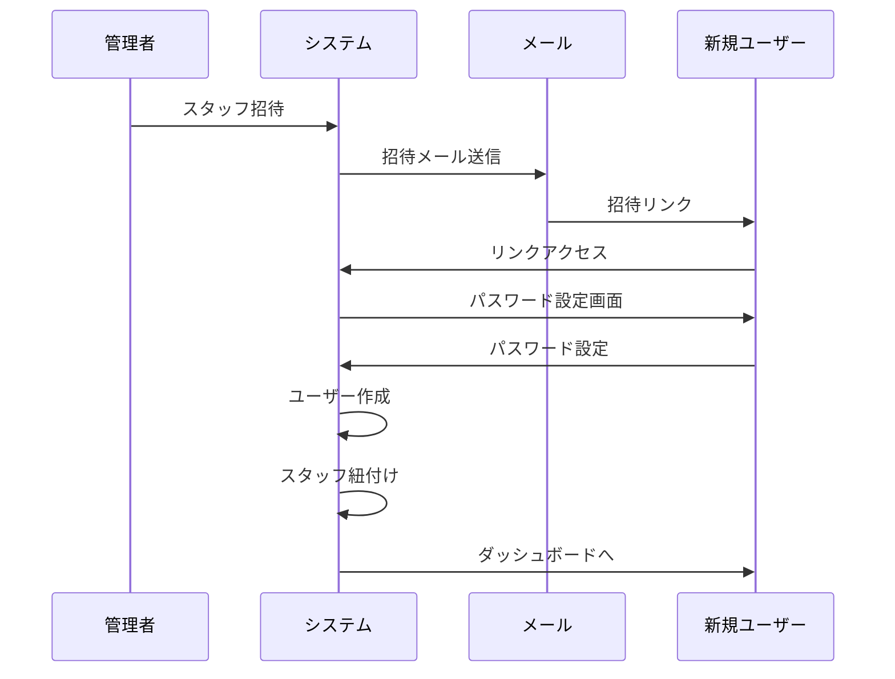

### 6.3 画面一覧

| 画面 | パス | 機能 |
|-----|------|------|
| ログイン | `/login` | メール・パスワードでログイン |
| 新規登録 | `/signup` | 顧客アカウント作成 |
| パスワードリセット | `/reset-password` | リセットメール送信 |
| パスワード設定 | `/set-password` | 初回パスワード設定（招待経由） |
| 招待受諾 | `/accept-invitation?token=xxx` | 組織招待の受諾 |

---

## 7. マルチテナントフロー

### 7.1 組織登録フロー

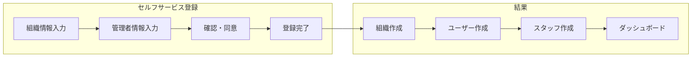

### 7.2 テナント管理（ライセンス管理者専用）

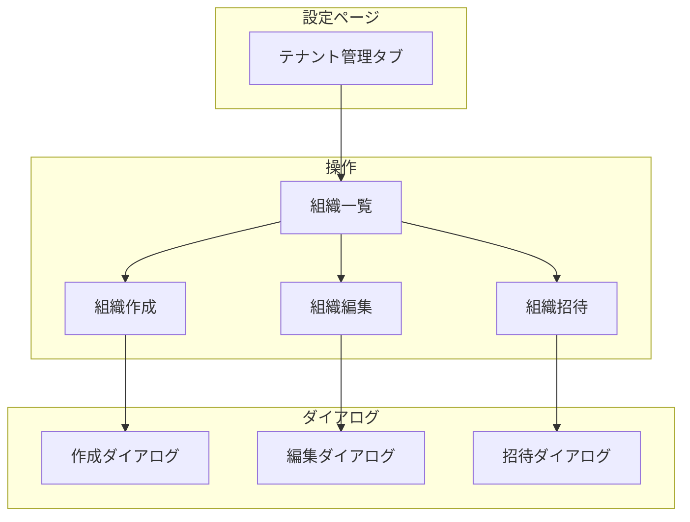

### 7.3 画面一覧

| 画面 | パス | 機能 | アクセス |
|-----|------|------|---------|
| 組織登録 | `/organization-register` | セルフサービス登録 | 全員 |
| 招待受諾 | `/accept-invitation` | 組織への参加 | 招待者 |
| 設定 > 組織情報 | `/settings` (タブ) | 自組織の設定 | admin |
| 設定 > テナント管理 | `/settings` (タブ) | 全組織管理 | ライセンス管理者のみ |

---

## 8. 作者ポータルフロー

### 8.1 作者ダッシュボード

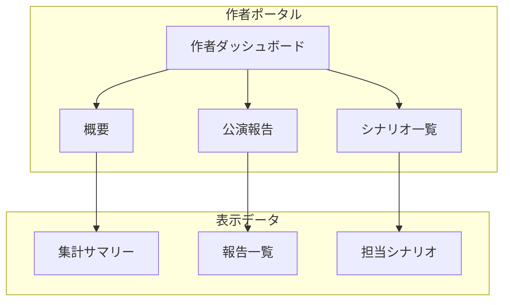

### 8.2 メールアドレスベース認証

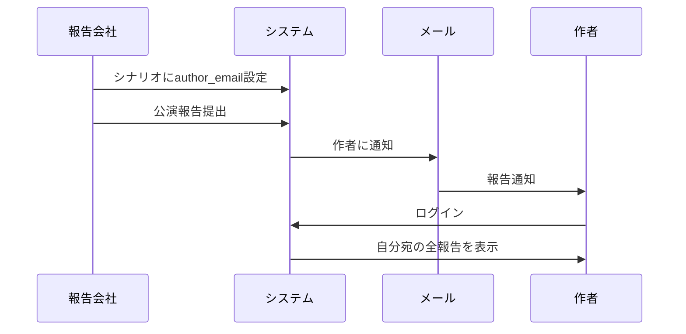

---

## 関連ドキュメント

- [pages.md](../pages.md) - 詳細なページ一覧
- [features.md](../features.md) - 機能詳細
- [database-design.md](./database-design.md) - データベース設計
- [api-design.md](./api-design.md) - API設計

